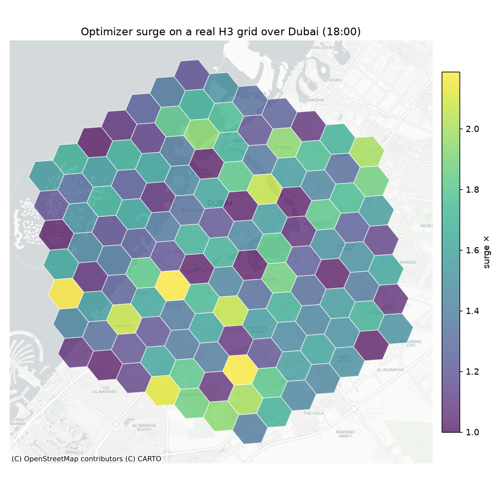
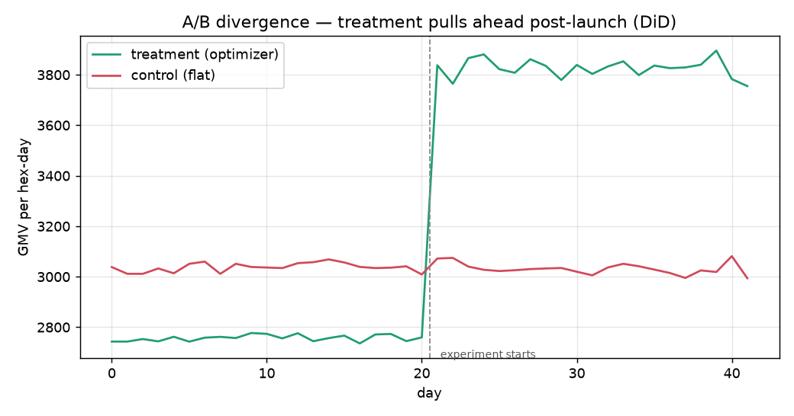
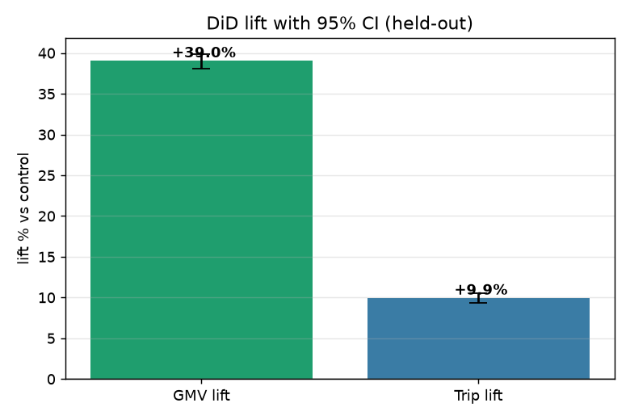

# 🚗 AutoPricing Experimenter

**An interactive ride-hailing dynamic-pricing demo** — a tiny, modular surge
optimizer wrapped in an A/B **and** switchback experiment platform with live
tracking and a Difference-in-Differences readout of **GMV lift** and **Trip lift**.

A small sandbox for exploring how surge pricing, forecasting, elasticity and
experimentation fit together on a real H3 map. Fully synthetic data.

> **▶ Run it:** `pip install -r requirements.txt && streamlit run app.py`

---

## Five small modules

The pricing system is deliberately simple — the standard, public decomposition:

1. **Demand forecast** — a (random) demand per hex-hour.
2. **Supply forecast** — a (random) supply per hex-hour (lags demand at peaks).
3. **Demand elasticity** — how riders react to price, **by hour** (rush = inelastic).
4. **Supply elasticity** — how drivers react to price, **by hour** (evening = responsive).
5. **Optimizer** — for each hex, **grid-search** the surge multiplier that maximises
   predicted rides (or GMV). No solver, no LP — a plain per-hex search:

   `D(m)=D·[1−εᵈₕ(m−1)]`,  `S(m)=S·[1+εˢₕ(m−1)]`,  `m* = argmax objective(min(D(m),S(m)))`.

## The app (4 tabs)

| Tab | What |
|---|---|
| 🗺️ **Live map** | Real **H3** hex grid over **Dubai** on a real basemap (pydeck). |
| 🧪 **Experiment (live)** | Treatment vs control optimizer, **A/B** or **Switchback**; watch GMV & trips diverge live. |
| 📊 **Results (DiD)** | GMV & Trip lift with **95% CI, p-value, verdict**, plus an **AI narrator**. |
| 📖 **How it works** | The five modules + the hour-of-day elasticity curves. |

## The experiment (DiD)

- **A/B (spatial):** hexes randomized to treatment/control; a pre-period enables a
  classic **2×2 DiD**: `(T_post−T_pre)−(C_post−C_pre)`; CI by bootstrap over hexes.
- **Switchback (temporal):** the whole city alternates treatment/control by time
  block; effect via **two-way (day × hour) fixed effects** — the switchback
  analogue of DiD; CI by block bootstrap over days.

Default run (dynamic max-rides optimizer vs flat) → **GMV ≈ +39%**, **Trips ≈ +10%**,
tight CIs, p<0.001. Switching the treatment to *max-GMV* shows the opposite
trade-off (revenue up, trips down); *static elasticity* is measurably worse than the
hour-aware optimizer.

## Figures

| Real H3 surge map over Dubai | A/B divergence (DiD) | Lift with 95% CI |
|---|---|---|
|  |  |  |

## Files

| File | What |
|---|---|
| `app.py` | The Streamlit app (the deliverable). |
| `engine.py` | The 5 modules + synthetic H3 city/panel + outcome model. |
| `experiment.py` | A/B & switchback simulation, DiD estimators, LLM narrator. |
| `make_figures.py` | Regenerates the README PNGs. |
| `requirements.txt` | Dependencies. |

## Notes

- **Everything is synthetic** (allowed by the brief) — random forecasts, invented
  hourly elasticities, no real data. Nothing here is confidential.
- The optimizer is a plain grid search built from scratch for this demo.
